# 👋 Olá, eu sou Kelvin Palka

### Desenvolvedor em formação • Full Stack • Software & Tecnologia

Estudante de **Desenvolvimento de Sistemas**, interessado em transformar problemas reais em soluções por meio de software.

---

## 👨‍💻 Sobre mim

* 🎓 Cursando **Ensino Médio integrado ao Técnico em Desenvolvimento de Sistemas**, com conclusão prevista para **dezembro de 2026**.
* 📚 Formação técnica em **Marketing**, concluída em **2026**.
* 💻 Estudo e desenvolvo projetos com foco em **Front-end, Back-end, Mobile, Desktop e Banco de Dados**.
* 🧠 Tenho interesse em **arquitetura de software, inteligência artificial, automação e sistemas embarcados**.
* 🚀 Busco aplicar o que aprendo em projetos reais, da ideia e modelagem até a implementação.

---

## 🚀 Projeto em destaque

### CONG — Construtor Operacional para ONGs

A **CONG** é uma plataforma **SaaS multi-tenant e modular** desenvolvida como Trabalho de Conclusão de Curso em Desenvolvimento de Sistemas.

O projeto foi pensado para permitir que diferentes ONGs utilizem uma mesma plataforma, mantendo isolados seus **dados, usuários, permissões e configurações**, além de possibilitar a composição de sistemas conforme as necessidades de cada organização.

**Principais conceitos e recursos:**

* Arquitetura **SaaS Multi-Tenant**
* Autenticação e gerenciamento de usuários
* Controle de acesso e permissões
* Arquitetura modular
* APIs REST
* Aplicação web responsiva
* Desenvolvimento mobile
* Modelagem e gerenciamento de banco de dados
* UX/UI
* Segurança e proteção de dados

**Stack principal:**

  

---

## 🛠️ Tecnologias e ferramentas

### Front-end

  

### Back-end e Banco de Dados

  

### Desenvolvimento Desktop e outras linguagens

  

### Ferramentas

  

---

## 🎯 Áreas de interesse

* Desenvolvimento **Full Stack**
* Desenvolvimento **Mobile**
* Desenvolvimento **Desktop**
* Arquitetura de Software
* Banco de Dados
* Inteligência Artificial e Machine Learning
* Automação
* Sistemas Embarcados

---

## 📊 Estatísticas do GitHub

  
  

> Os cards acima são gerados automaticamente pelo GitHub Actions e armazenados neste repositório.

---

## 🏆 Reconhecimentos

* 🥉 **Medalha de Bronze Regional** — Matemática Sem Fronteiras 2024
* 🏅 **Menção Honrosa Nacional** — Matemática Sem Fronteiras 2024

---

## 📚 Atualmente

* Desenvolvendo e evoluindo a **CONG**
* Aprofundando conhecimentos em desenvolvimento **Full Stack**
* Estudando arquitetura e organização de aplicações
* Expandindo conhecimentos em **Inteligência Artificial e Machine Learning**
* Construindo projetos para aplicar conhecimentos de forma prática

---

### 📫 Contato

